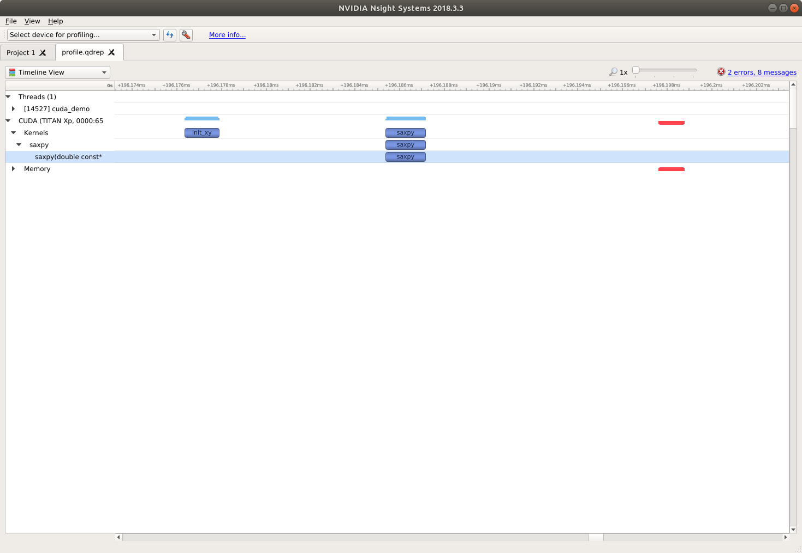

# CUDA Demo

A quick cuda demo. To build

```
mkdir build && cd build
cmake ../
make
./cuda_demo
```

To profile using nsight-systems (which replaces `nvprof`).

```
nsys profile --trace=cuda -o profile_name cuda_demo
```

"Import" `profile_name` using the `nsight-sys` GUI program. After some zooming you will see


